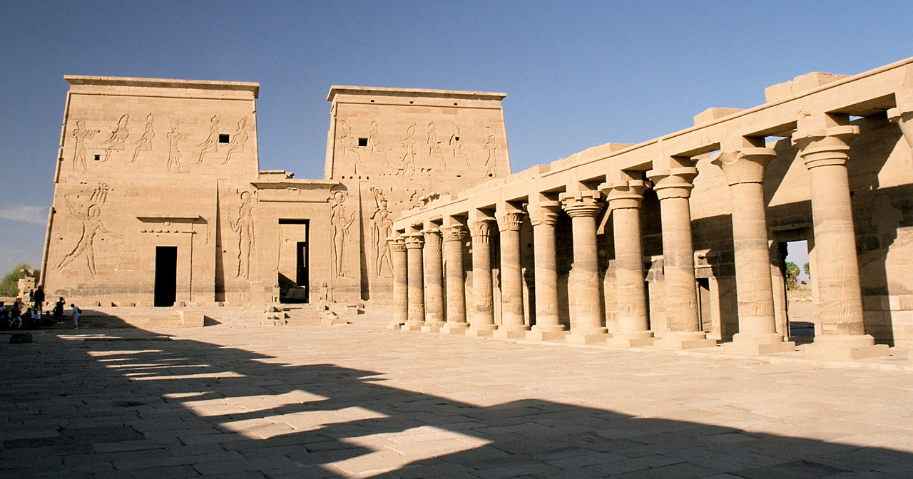

Pyramids and Sphinx are the most amazing things to see where ancient Egyptians made this art of architecture.
Salaheldeen Citadel as well one of the amazing things to see where you can enjoy the building beside attending Arabic tradition ceremony there.
